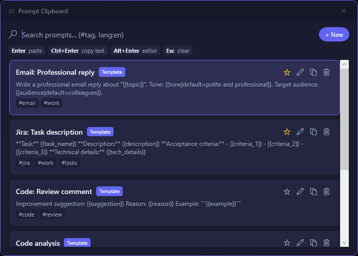
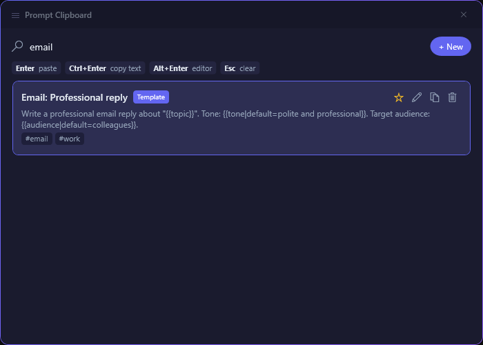
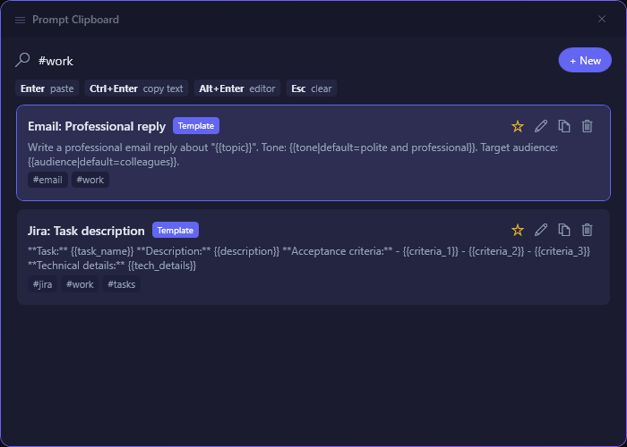
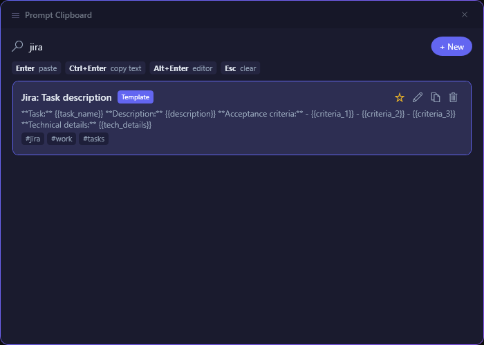
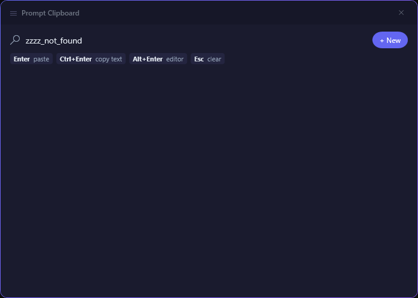
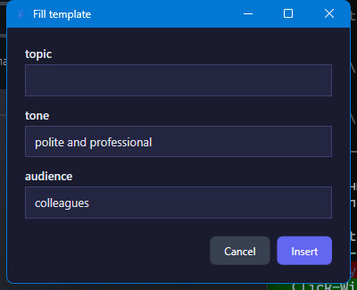
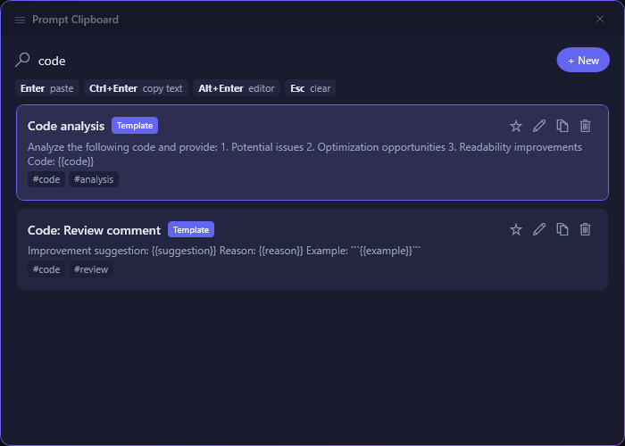
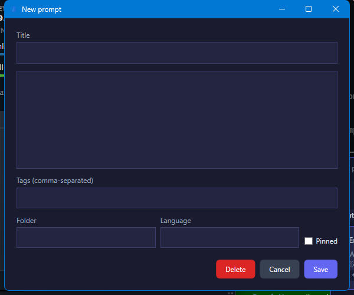
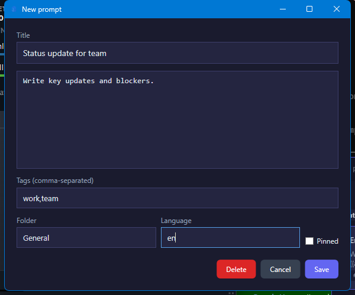
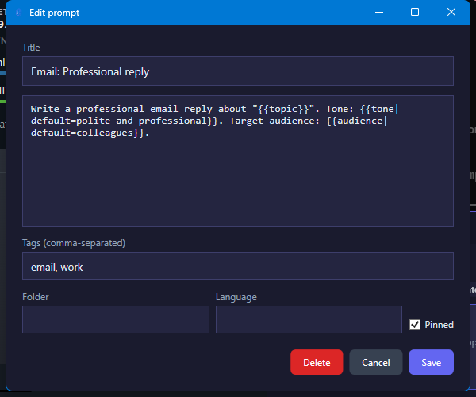

<p align="center">
  
</p>

<h1 align="center">Prompt Clipboard</h1>

<p align="center">
  <strong>Win+V for prompts</strong> — fast prompt manager with global hotkey, template variables, and instant paste.
</p>

<p align="center">
  <a href="https://buymeacoffee.com/gagik">
    
  </a>
</p>

<p align="center">
  <a href="#features">Features</a> &bull;
  <a href="#screenshots">Screenshots</a> &bull;
  <a href="#installation">Installation</a> &bull;
  <a href="#usage">Usage</a> &bull;
  <a href="#architecture">Architecture</a> &bull;
  <a href="#support">Support</a> &bull;
  <a href="#license">License</a>
</p>

---

## Features

- **Global hotkey** (`Ctrl+Shift+Q`) — summon the palette from any app, paste directly
- **Smart search** — fuzzy matching, tag filtering (`#tag`), language filter (`lang:ru`)
- **Template variables** — `{{name}}`, defaults (`{{tone|default=formal}}`), interactive dialog
- **Smart body preview** — long prompts show a condensed first line with metadata badge and expandable preview
- **Pin & organize** — pin frequently used prompts, tag-based organization
- **Instant paste** — copies to clipboard and simulates Ctrl+V into the target window
- **Caret-aware positioning** — palette appears near the text cursor
- **System tray** — runs in background, minimal footprint
- **Local storage** — SQLite database, all data stays on your machine
- **Import/Export** — JSON-based backup and sharing

## Screenshots

### Home and Search

| Home | Keyword Search | Tag Filter | Jira Search |
|---|---|---|---|
|  |  |  |  |

### Workflows

| Empty Results | Template Dialog | Code Search | New Prompt |
|---|---|---|---|
|  |  |  |  |

| New Prompt (Filled) | Edit Prompt |
|---|---|
|  |  |

## Installation

### Setup (recommended)

1. Download `PromptClipboard-Setup.exe` from [Releases](../../releases)
2. Run it — one-click install, no admin required
3. Installed to `%LOCALAPPDATA%\PromptClipboard`
4. Auto-updates are checked on startup; update prompt appears in the system tray

### Portable

1. Download `PromptClipboard-Portable.zip` from [Releases](../../releases)
2. Extract anywhere
3. Run `PromptClipboard.App.exe`
4. Self-updating — updates are downloaded and applied automatically

> **Upgrading from a previous version?** Uninstall the old version first via Windows Settings > Apps, then install fresh. Your data (prompts, settings) is preserved.

### Requirements

- Windows 10 version 1809+ / Windows 11
- .NET 8 Desktop Runtime (bundled in self-contained builds)

## Usage

| Shortcut | Action |
|---|---|
| `Ctrl+Shift+Q` | Toggle palette |
| `Enter` | Paste prompt into target window |
| `Ctrl+Enter` | Copy to clipboard (no paste) |
| `Alt+Enter` | Open editor |
| `Esc` | Clear search / close palette |
| Type to search | Fuzzy search across titles and body |
| `#tag` | Filter by tag |

### Template Variables

Prompts support `{{variable}}` placeholders with optional defaults:

```
Write a {{tone|default=professional}} email about {{topic}}.
Target audience: {{audience|default=colleagues}}.
```

When you paste a template prompt, a dialog appears to fill in the values.

### Settings

Configuration is stored in `%APPDATA%/PromptClipboard/settings.json`:

```json
{
  "hotkey": "Ctrl+Shift+Q",
  "pasteDelayMs": 50,
  "restoreDelayMs": 150,
  "autoStart": false
}
```

## Architecture

Clean Architecture with 4 layers:

```
src/
  PromptClipboard.Domain/          # Entities, interfaces — zero dependencies
  PromptClipboard.Application/     # Use cases, services — depends on Domain
  PromptClipboard.Infrastructure/  # SQLite, Win32 APIs — depends on Domain
  PromptClipboard.App/             # WPF UI, DI composition — depends on all
tests/
  PromptClipboard.Domain.Tests/
  PromptClipboard.Application.Tests/
  PromptClipboard.Infrastructure.Tests/
```

### Tech Stack

| Component | Technology |
|---|---|
| UI Framework | WPF (.NET 8) |
| Database | SQLite via Dapper |
| DI Container | Microsoft.Extensions.DependencyInjection |
| MVVM | CommunityToolkit.Mvvm |
| Logging | Serilog |
| Tray Icon | Hardcodet.NotifyIcon.Wpf |
| Platform APIs | Win32 P/Invoke (hotkeys, clipboard, focus tracking) |

## Support

If Prompt Clipboard saves you time, you can support development:

<a href="https://buymeacoffee.com/gagik">
  
</a>

- Goal: `$300` for code-signing certificate and release automation
- Suggested support: `$3` coffee, `$5` release support, `$10` sponsor feature requests
- Crypto support (USDT, TRC20): `TB4iCH96KgM6tLK5gUjqVSHwiKpn9vBBFF`
- Network note: send only via `TRX (TRC20)` to avoid loss
- Crypto support (BTC): `1D3MjwgDkZSMedLxSNzMHdMvpBEwbx5Yuv`
- Network note: send only via `Bitcoin (BTC mainnet)`
- Crypto support (ETH on BSC/BEP20): `0xfb096327df1ac8fd715d9fdf08196fa2ade2ce37`
- Network note: send only via `BNB Smart Chain (BEP20)`

## License

Prompt Clipboard is licensed under the GNU General Public License v3.0 or later (`GPL-3.0-or-later`).
See [LICENSE](LICENSE) for the full text.
